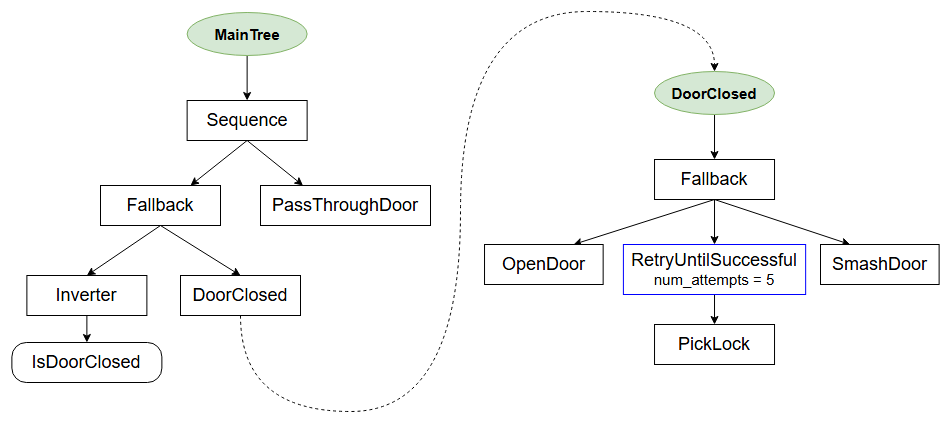

### Compose behaviors using Subtrees：

使用子树组合行为

我们可以通过将较小且可重用的行为插入到更大的行为中，来构建大规模的行为。

换句话说，我们要创建分层的行为树，并使这些树具有可组合性。

这可以通过在 XML 中定义多个树，并使用 SubTree 节点将一个树包含到另一个树中来实现。

### CrossDoor behavior

这也是首个同时使用装饰器（`Decorators`）和回退（`Fallback`）的实际示例。



```xml
<root BTCPP_format="4">

    <BehaviorTree ID="MainTree">
        <Sequence>
            <Fallback>
                <Inverter>
                    <IsDoorClosed/>
                </Inverter>
                <SubTree ID="DoorClosed"/>
            </Fallback>
            <PassThroughDoor/>
        </Sequence>
    </BehaviorTree>

    <BehaviorTree ID="DoorClosed">
        <Fallback>
            <OpenDoor/>
            <RetryUntilSuccessful num_attempts="5">
                <PickLock/>
            </RetryUntilSuccessful>
            <SmashDoor/>
        </Fallback>
    </BehaviorTree>
    
</root>
```

**The desired behavior is:**

* 如果门是开着的， `PassThroughDoor`.

* 如果门是关着的，请尝试 `OpenDoor`，或最多尝试5次`PickLock`，最后再尝试`SmashDoor`。

* \- 如果 `DoorClosed` 子树中的至少一个操作成功，则执行 `PassThroughDoor`。

## The CPP code

我们不会展示 `CrossDoor `中虚拟操作的详细实现，唯一值得关注的代码片段大概就是 `registerNodes`。

```c++

class CrossDoor
{
public:
    void registerNodes(BT::BehaviorTreeFactory& factory);

    // SUCCESS if _door_open != true
    BT::NodeStatus isDoorClosed();

    // SUCCESS if _door_open == true
    BT::NodeStatus passThroughDoor();

    // After 3 attempts, will open a locked door
    BT::NodeStatus pickLock();

    // FAILURE if door locked
    BT::NodeStatus openDoor();

    // WILL always open a door
    BT::NodeStatus smashDoor();

private:
    bool _door_open   = false;
    bool _door_locked = true;
    int _pick_attempts = 0;
};

// Helper method to make registering less painful for the user
void CrossDoor::registerNodes(BT::BehaviorTreeFactory &factory)
{
  factory.registerSimpleCondition(
      "IsDoorClosed", std::bind(&CrossDoor::isDoorClosed, this));

  factory.registerSimpleAction(
      "PassThroughDoor", std::bind(&CrossDoor::passThroughDoor, this));

  factory.registerSimpleAction(
      "OpenDoor", std::bind(&CrossDoor::openDoor, this));

  factory.registerSimpleAction(
      "PickLock", std::bind(&CrossDoor::pickLock, this));

  factory.registerSimpleCondition(
      "SmashDoor", std::bind(&CrossDoor::smashDoor, this));
}

int main()
{
  BehaviorTreeFactory factory;

  CrossDoor cross_door;
  cross_door.registerNodes(factory);

  // In this example a single XML contains multiple <BehaviorTree>
  // To determine which one is the "main one", we should first register
  // the XML and then allocate a specific tree, using its ID

  factory.registerBehaviorTreeFromText(xml_text);
  auto tree = factory.createTree("MainTree");

  // helper function to print the tree
  printTreeRecursively(tree.rootNode());

  tree.tickWhileRunning();

  return 0;
}
```

