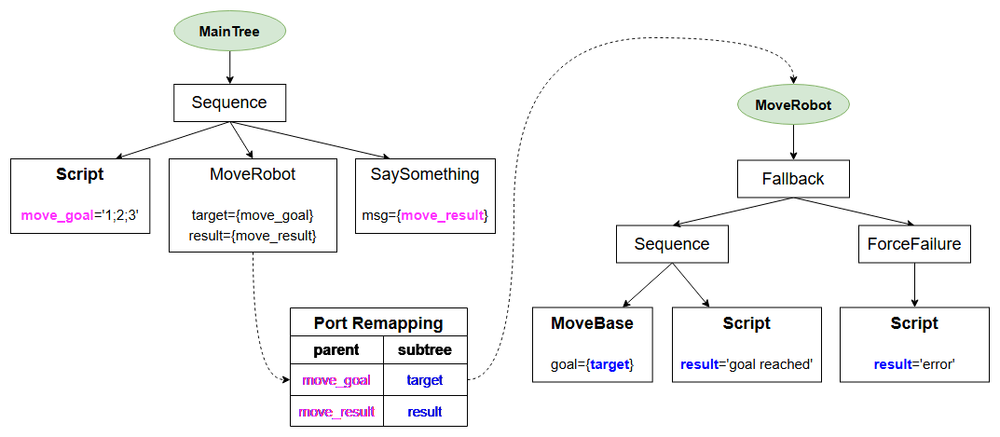

## Remapping ports of a SubTrees：

在 CrossDoor 示例中，我们看到从父树的角度来看，`SubTree`就像一个单叶节点。

为了避免在非常大的树中发生名称冲突，任何树和子树都使用不同的 Blackboard 实例。

因此，我们需要显式地将树的端口与其子树的端口连接起来。

您无需修改 C++ 实现，因为这种重新映射完全在 XML 定义中完成。

## Example：

让我们来看看这个行为树。




```xml
<root BTCPP_format="4">

    <BehaviorTree ID="MainTree">
        <Sequence>
            <Script code=" move_goal='1;2;3' " />
            <SubTree ID="MoveRobot" target="{move_goal}" 
                                    result="{move_result}" />
            <SaySomething message="{move_result}"/>
        </Sequence>
    </BehaviorTree>

    <BehaviorTree ID="MoveRobot">
        <Fallback>
            <Sequence>
                <MoveBase  goal="{target}"/>
                <Script code=" result:='goal reached' " />
            </Sequence>
            <ForceFailure>
                <Script code=" result:='error' " />
            </ForceFailure>
        </Fallback>
    </BehaviorTree>

</root>
```

### You may notice that:

* 我们有一个名为`  MainTree  `的主树，其中包含一个名为 `MoveRobot` 的子树。

* 我们希望将` MoveRobot` 子树内的端口与 `MainTree` 中的其他端口“连接”（即“重新映射”）。

* 这可以通过上文示例中使用的语法来实现。


这里没什么可做的。我们使用 `debugMessage` 方法来检查黑板的值。

```c++
int main()
{
  BT::BehaviorTreeFactory factory;

  factory.registerNodeType<SaySomething>("SaySomething");
  factory.registerNodeType<MoveBaseAction>("MoveBase");

  factory.registerBehaviorTreeFromText(xml_text);
  auto tree = factory.createTree("MainTree");

  // Keep ticking until the end
  tree.tickWhileRunning();

  // let's visualize some information about the current state of the blackboards.
  std::cout << "\n------ First BB ------" << std::endl;
  tree.subtrees[0]->blackboard->debugMessage();
  std::cout << "\n------ Second BB------" << std::endl;
  tree.subtrees[1]->blackboard->debugMessage();

  return 0;
}

/* Expected output:

------ First BB ------
move_result (std::string)
move_goal (Pose2D)

------ Second BB------
[result] remapped to port of parent tree [move_result]
[target] remapped to port of parent tree [move_goal]

*/
```

