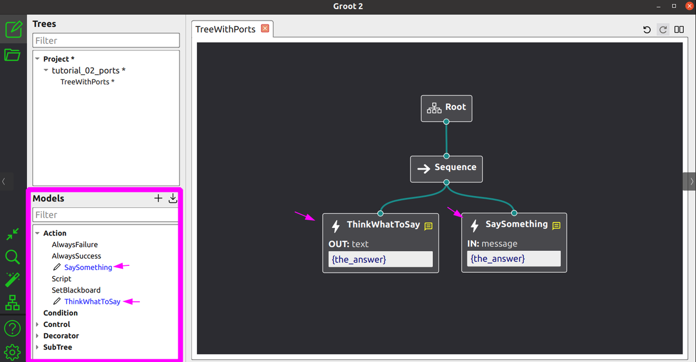

## **tutorial\_11\_groot2**

**Groot2** 是用于编辑、监视以及与使用 BT.CPP 创建的行为树进行交互的官方集成开发环境（IDE）。

正如您将在本教程中看到的，将二者集成非常简单，但您需要先了解一些基本概念。


## **TreeNodesModel**

Groot 需要一个“TreeNode 模型”。



例如，在上图中，格鲁特需要知道用户定义的节点 `ThinkWhatToSay` 和 `SaySomething` 存在。

此外，它还要求：这些模型以 XML 格式表示。在此情况下，它们应为：

* 节点类型

* 端口的名称和类型（输入/输出）。

```xml
  <TreeNodesModel>
    <Action ID="SaySomething">
      <input_port name="message"/>
    </Action>
    <Action ID="ThinkWhatToSay">
      <output_port name="text"/>
    </Action>
  </TreeNodesModel>
```

不过，**您不应手动编写这些 XML 描述**。

BT.CPP 提供了一个专门的函数，可以为您生成此 XML。

```c++
  BT::BehaviorTreeFactory factory;
  //
  // register here your user-defined Nodes
  // 
  std::string xml_models = BT::writeTreeNodesModelXML(factory);

  // this xml_models should be saved to file and 
  // loaded in Groot2
```

要将这些模型导入用户界面，请执行以下任一操作：

* 将 XML 保存为文件（例如命名为 `models.xml`），然后在 Groot2 中点击 **导入模型** 按钮。

* 或者直接将 XML 部分手动添加到您的 `.xml` 或 `.btproj` 文件中。


## **为Groot添加实时可视化功能**

> 目前，只有 Groot2 的 PRO 版本支持实时可视化。

将树连接到 Groot2 只需一行代码：

```plain&#x20;text
BT::Groot2Publisher publisher(tree);
```

这将在您的 BT.CPP 执行器与 Groot2 之间建立一个进程间通信服务，该服务：完整示例：

* 将整个树结构发送给 Groot2，包括上述的模型。

* 定期更新各个节点的状态（RUNNING、SUCCESS、FAILURE、IDLE）。

* 发送黑板（blackboard）的值；整数、实数和字符串等基本类型开箱即用，其他类型需要手动添加。

* 允许 Groot2 插入断点、执行节点替换或故障注入。


## Full example:

```xml
<root BTCPP_format="4">

  <BehaviorTree ID="MainTree">
    <Sequence>
      <Script code="door_open:=false" />
      <Fallback>
        <Inverter>
          <IsDoorClosed/>
        </Inverter>
        <SubTree ID="DoorClosed" _autoremap="true" door_open="{door_open}"/>
      </Fallback>
      <PassThroughDoor/>
    </Sequence>
  </BehaviorTree>

  <BehaviorTree ID="DoorClosed">
    <Fallback name="tryOpen" _onSuccess="door_open:=true">
      <OpenDoor/>
        <RetryUntilSuccessful num_attempts="5">
          <PickLock/>
        </RetryUntilSuccessful>
      <SmashDoor/>
    </Fallback>
  </BehaviorTree>

</root>
```

```c++
int main()
{
  BT::BehaviorTreeFactory factory;

  // Our set of simple Nodes, related to CrossDoor
  CrossDoor cross_door;
  cross_door.registerNodes(factory);

  // Groot2 editor requires a model of your registered Nodes.
  // You don't need to write that by hand, it can be automatically
  // generated using the following command.
  std::string xml_models = BT::writeTreeNodesModelXML(factory);

  factory.registerBehaviorTreeFromText(xml_text);
  auto tree = factory.createTree("MainTree");

  // Connect the Groot2Publisher. This will allow Groot2 to
  // get the tree and poll status updates.
  BT::Groot2Publisher publisher(tree);

  // we want to run this indefinitely
  while(1)
  {
    std::cout << "Start" << std::endl;
    cross_door.reset();
    tree.tickWhileRunning();
    std::this_thread::sleep_for(std::chrono::milliseconds(3000));
  }
  return 0;
}
```


## **在黑板中可视化自定义类型**

黑板内的内容会以 JSON 格式发送至 Groot2。

基本类型（整数、实数、字符串）开箱即用。若要让 Groot2 能够可视化您的自定义类型，您需要包含 **behaviortree\_cpp/json\_export.h** 并定义一个 JSON 转换器。

### **使用 BT\_JSON\_CONVERTER 宏（推荐）**

最简单的方法是使用 `BT_JSON_CONVERTER` 宏。假设有一个用户定义的类型：

```c++
struct Position2D
{
  double x;
  double y;
};
```

在文件作用域内（任何函数之外）定义转换器：

```c++
#include "behaviortree_cpp/json_export.h"

BT_JSON_CONVERTER(Position2D, pos)
{
  add_field("x", &pos.x);
  add_field("y", &pos.y);
}
```

这同样适用于嵌套类型：

```c++
struct Waypoint
{
  std::string name;
  Position2D position;
  double speed = 1.0;
};

BT_JSON_CONVERTER(Waypoint, wp)
{
  add_field("name", &wp.name);
  add_field("position", &wp.position);
  add_field("speed", &wp.speed);
}
```

然后，在主函数中（在创建树之前）注册这些类型：

```c++
BT::RegisterJsonDefinition<Position2D>();
BT::RegisterJsonDefinition<Waypoint>();
```

请参阅 [t11\_groot\_howto.cpp](https://github.com/BehaviorTree/BehaviorTree.CPP/blob/master/examples/t11_groot_howto.cpp) 中的完整示例。


### **手动转换（替代方案）**

如果您需要对 JSON 序列化进行更多控制，可以编写一个具有以下签名的转换函数`void(nlohmann::json&, const T&)`并显式注册它：

```c++
void PositionToJson(nlohmann::json& dest, const Position2D& pos) {
  dest["x"] = pos.x;
  dest["y"] = pos.y;
}

// in main()
BT::RegisterJsonDefinition<Position2D>(PositionToJson);
```

