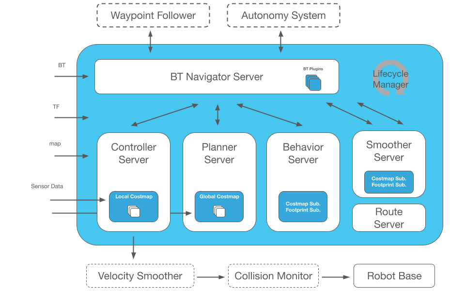
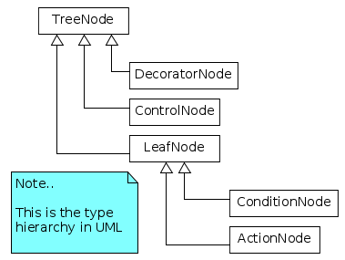
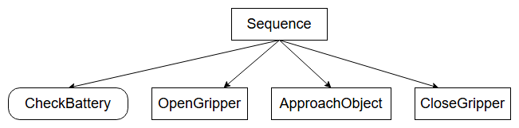
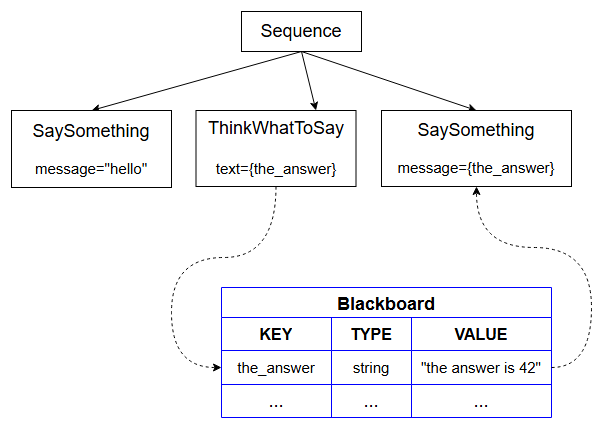

## 基本概念：

### BT：



与有限制的状态机不同，行为树是一种**层级节点树，用于控制任务的执行流程**


**核心概念：**

* 使用 “**tick**” 发送向树的根部，沿着树传播，直到到达叶节点

* 任何TreeNode收到 “**tick**” 后执行callback，必须返回一种状态（SUCCESS/FAILURE/RUNNING/）

* 没有子节点的叶节点是实际执行任务的节点（比如Action）

> The word tick will be often used as a verb (to tick / to be ticked) and it means:
>
> "To invoke the callback tick() of a TreeNode".


**tick工作原理：**

<iframe src="https://www.behaviortree.dev/assets/images/sequence_animation-4155a892772542caf81fa16c824c91f8.svg" sandbox="allow-scripts allow-same-origin allow-presentation allow-forms allow-popups allow-downloads" allowfullscreen allow="encrypted-media; fullscreen; autoplay" referrerpolicy="strict-origin-when-cross-origin" frameborder="0" style="width: 100%; min-height: 457px; border-radius: 8px;"></iframe>

1. 第一次勾选将序列节点设置为运行中（橙色）。

2. 序列勾选第一个子项“OpenDoor”，最终返回SUCCESS。

3. 因此，第二个子项“Walk”和后来的“CloseDoor”被勾选。

4. 一旦最后一个子项完成，整个序列将从RUNNING切换到SUCCESS。


#### 节点类型：



**区分：（同步/异步节点）**

1. 同步节点：在执行返回成功或失败之前，阻塞整个树

2. 异步节点：可以返回RUNNING（运行中），表明操作任在执行，需要 tick 重试，直到返回成功或失败


#### tick（）回调函数：

任何 TreeNode 都可以被视为调用回调函数（即运行一段代码，调用一个独立函数）的机制。至于回调函数具体返回什么，则由代码设计决定。

```c++
// The simplest callback you can wrap into a BT Action
NodeStatus HelloTick()
{
  std::cout << "Hello World\n"; 
  return NodeStatus::SUCCESS;
}

// Allow the library to create Actions that invoke HelloTick()
// (explained in the tutorials)
factory.registerSimpleAction("Hello", std::bind(HelloTick));
```

> The factory may create multiple instances of the node Hello.
>
> factory函数可以注册各种各样的节点，比如这里的“Hello”


#### 自定义节点：

比如上述示例中的HelloTick，调用一种特定的TreeNode，这是基于函数指针完成的

通常来说，想要自定义TreeNode必须继承自：

* `ActionNodeBase`

* `ConditionNode`

* `DecoratorNode`


#### Dataflow, Ports and Blackboard

为了方便理解，我们可以把**行为树（Behavior Tree）想象成一个车间**，里面的**节点（Nodes）就是流水线上的工人**。

1. **黑板 (Blackboard) = 车间里的公共大白板**

   * 它就是一个所有工人都能看到、也都能去写字的公共告示牌。

   * 上面记录的信息是“成对”的（Key/Value）。比如大白板上写着：`[目标位置] = (100, 200)`，`[敌人距离] = 5米`。这里的“目标位置”就是键（Key），“(100, 200)”就是值（Value）。

2. **端口 (Ports) = 工人的收件箱和发件箱**

   * **输入端口 (Input Port)：** 相当于工人的眼睛，专门用来从大白板上**读取**某个特定的任务。

   * **输出端口 (Output Port)：** 相当于工人的手，专门用来把完成的任务**写回**大白板上。

3. **端口怎么“连接”？ = 大家通过白板间接沟通**

   * 在行为树里，节点和节点之间是**不直接对话**的！

   * 比如，“寻找敌人”节点（工人A）看到了敌人，他通过**输出端口**在白板上写下：`[敌人坐标] = (X, Y)`。

   * 接着，“走向敌人”节点（工人B）通过**输入端口**一直盯着白板上的 `[敌人坐标]`。只要上面有字，他就会读出来并朝着那个坐标走。

   * 这样，工人A和工人B就通过黑板上的同一个“词（Key）”完成了信息传递（连接）。

4. **编译时 (C++) vs 部署时 (XML) = 制造工人 vs 分配任务**

   * **C++ 编译时：** 你在写 C++ 代码造这个工人的时候，就得规定死他有几个“收件箱/发件箱”。比如你规定“走向目标”节点必须需要一个名叫 `target` 的输入端口，这不能随便改。

   * **XML 部署时：** 但这个 `target` 端口具体去白板上看哪个词？这可以在 XML 里灵活配置。你可以让它看 `[敌人坐标]`，也可以让它看 `[补给箱坐标]`，完全不用改 C++ 代码重新编译。

5. **任何 C++ 类型 = 白板上什么都能画**

   * 这意味着大白板上不仅能写简单的数字（比如血量 100），还能放非常复杂的东西。比如一整张 3D 地图的数据、激光雷达的扫描数组，或者是你自己定义的 C++ 结构体。只要你想存，黑板都能装得下。

   * 你可以将任何 C++ 类型的数据存储为黑板里的值（底层使用了类似于 `std::any`）


#### 子树：

```xml
 <root BTCPP_format="4" >
 
     <BehaviorTree ID="MainTree">
        <Sequence>
           <Action  ID="SaySomething"  message="Hello World"/>
           <SubTree ID="GraspObject"/> <!-- 在Subtree这里包含子 -->
        </Sequence>
     </BehaviorTree>
     
     <BehaviorTree ID="GraspObject">
        <Sequence>
           <Action ID="OpenGripper"/>
           <Action ID="ApproachObject"/>
           <Action ID="CloseGripper"/>
        </Sequence>
     </BehaviorTree>  
 </root>
```

我们可以注意到，“GraspObject”树是在“SaySomething”之后执行的。


#### 外部文件包含：

```c++
  <include path="relative_or_absolute_path_to_file">
```

同理，可以将一个行为树拆成两个文件：

```xml
 <!-- file maintree.xml -->

 <root BTCPP_format="4" >
         
         <include path="grasp.xml"/>
         
     <BehaviorTree ID="MainTree">
        <Sequence>
           <Action  ID="SaySomething"  message="Hello World"/>
           <SubTree ID="GraspObject"/>
        </Sequence>
     </BehaviorTree>
  </root>
```

```xml
 <!-- file grasp.xml -->

 <root BTCPP_format="4" >
     <BehaviorTree ID="GraspObject">
        <Sequence>
           <Action ID="OpenGripper"/>
           <Action ID="ApproachObject"/>
           <Action ID="CloseGripper"/>
        </Sequence>
     </BehaviorTree>  
 </root>
```

这样有利于机器人在不同的区域执行不同的任务，比如RC26中三个任务区可以设计三棵子树，这样便于调试和在不同区域重试。


### XML 语法：

#### 1. The XML schemaXML

```xml
 <root BTCPP_format="4">    <!-- root包含n个标签和树的属性 -->
     <BehaviorTree ID="MainTree">    <!-- 树属性的ID,用于注册TreeNode -->
        <Sequence name="root_sequence">    <!-- 实例名称，optional -->
            <SaySomething   name="action_hello" message="Hello"/>
            <OpenGripper    name="open_gripper"/>
            <ApproachObject name="approach_object"/>
            <CloseGripper   name="close_gripper"/>
        </Sequence>
     </BehaviorTree>
 </root>
```

**节点属性：**

* `ControlNodes` 包含1 \~ N个子节点

* `DecoratorNodes` 子树，只有一个子节点

* `ActionNodes` 和 `ConditionNodes` 没有子节点


#### 2. Ports Remapping and pointers to Blackboards entries

**Inputs ports：**

> input/output ports can be remapped using the name of an entry in the Blackboard, in other words, the **key** of a **key/value** pair of the BB.

黑板中的 key 本质是一对 key/value 称作BB，BB key通常用`{key_name}`表示

```xml
 <root BTCPP_format="4" >
     <BehaviorTree ID="MainTree">
        <Sequence name="root_sequence">
            <SaySomething message="Hello"/>
            <SaySomething message="{my_message}"/>
        </Sequence>
     </BehaviorTree>
 </root>
```

> The value of the entry "greetings" can (and probably will) change at run-time.

```c++
class SaySomething : public SyncActionNode
{
public:
  // If your Node has ports, you must use this constructor signature 
  SaySomething(const std::string& name, const NodeConfig& config)
    : SyncActionNode(name, config)
  { }

  // It is mandatory to define this STATIC method.
  static PortsList providedPorts()
  {
    // This action has a single input port called "message"
    return { InputPort<std::string>("message") };
  }

  // Override the virtual function tick()
  NodeStatus tick() override
  {
    Expected<std::string> msg = getInput<std::string>("message");
    // Check if expected is valid. If not, throw its error
    if (!msg)
    {
      throw BT::RuntimeError("missing required input [message]: ", 
                              msg.error() );
    }
    // use the method value() to extract the valid message.
    std::cout << "Robot says: " << msg.value() << std::endl;
    return NodeStatus::SUCCESS;
  }
};
```


**当自定义TreeNode具有输入或输出端口时，端口必须用静态变量声明**

```c++
static MyCustomNode::PortsList providedPorts();
```

**使用`TreeNode::getInput<T> （钥匙）`&#x20;**&#x4ECE;blackboard中获取 key

> 通常在 tick() 中调用 getInput() 方法 ，而不是在类的构造函数中
>
> C++代码接受到的为实际输入值，变量


**Output ports：**

指向黑板入口的输入端口只有在另一个节点已经在该入口处写入“某些内容”时才有效。

```typescript
class ThinkWhatToSay : public SyncActionNode
{
public:
  ThinkWhatToSay(const std::string& name, const NodeConfig& config)
    : SyncActionNode(name, config)
  { }

  static PortsList providedPorts()
  {
    return { OutputPort<std::string>("text") };
  }

  // This Action writes a value into the port "text"
  NodeStatus tick() override
  {
    // the output may change at each tick(). Here we keep it simple.
    setOutput("text", "The answer is 42" );
    return NodeStatus::SUCCESS;
  }
};
```


**Bidirectional ports（双向端口）：**

如果想要一个节点同时具备输入输出能力，推荐使用双向端口

```c++
static PortsList providedPorts()
{
    return { BidirectionalPort<std::vector<int>>("vector"),
             InputPort<int>("value") };
}
```

> A bidirectional port is typically used with getLockedPortContent() for thread-safe read-modify-write access to the blackboard entry. See Tutorial 13: Access a port by reference for a complete explanation and examples.


## 行为树：

### 行为树基础：

#### 1. Your first Behavior Tree：

如何创建Action Nodes？



**TreeNode的默认创建方式是通过继承**

```c++
#include <iostream>
#include <string>
/**
 * @class ApproachObject
 * @brief 自定义的行为树同步动作节点，用于执行"接近物体"的任务
 * 
 * 继承自 BT::SyncActionNode，表示这是一个同步执行的行动节点
 * 同步节点在执行时会阻塞树的其他分支，直到该节点完成执行
 */
class ApproachObject : public BT::SyncActionNode
{
public:
    /**
     * @brief 构造函数，创建 ApproachObject 节点
     * 
     * @param name 节点名称，用于在行为树中标识该节点
     *              - 类型：const std::string& (常量字符串引用)
     *              - 作用：在行为树调试时显示节点身份，也用于日志输出
     *              - 要求：建议使用有意义的名称，如 "ApproachObject"
     * 
     * 使用初始化列表调用父类 BT::SyncActionNode 的构造函数
     * 参数说明：
     *   - name: 传递给父类的节点名称
     *   - {}: 空的动作节点配置参数（可选的 NodeConfiguration）
     */
    ApproachObject(const std::string& name)
        : BT::SyncActionNode(name, {})
    {
        // 构造函数体
    }

    /**
     * @brief 节点执行函数，当行为树调度器选中该节点时调用
     * 
     * 这是行为树节点的核心执行逻辑，每次数行为树执行到该节点时都会调用
     * 
     * @return BT::NodeStatus 返回节点的执行状态
     *         - BT::NodeStatus::SUCCESS: 任务成功完成
     *         - BT::NodeStatus::FAILURE: 任务执行失败
     *         - BT::NodeStatus::RUNNING: 任务还在执行中（仅用于异步节点）
     * 
     * override 关键字表示该函数重写了父类的虚函数，这是必须的
     */
    BT::NodeStatus tick() override
    {
        // this->name(): 获取当前节点的名称，this 指针指向对象本身
        //              name() 是从父类继承来的方法，返回节点名称
        std::cout << "ApproachObject: " << this->name() << std::endl;
        return BT::NodeStatus::SUCCESS;
    }
};

// 使用示例和说明：
/*
 * ============================================================
 *  BehaviorTree.CPP 框架简要说明：
 * ============================================================
 * 
 * 1. SyncActionNode vs AsyncActionNode:
 *    - SyncActionNode: 同步动作节点，执行过程会阻塞，tick() 只调用一次
 *    - AsyncActionNode: 异步动作节点，可以暂停执行，tick() 可能被多次调用
 * 
 * 2. 节点状态说明:
 *    - SUCCESS:  节点成功完成任务
 *    - FAILURE:  节点未能完成任务
 *    - RUNNING:  节点仍在执行中（需要后续继续执行）
 * 
 * 3. 使用方法:
 *    - 在 XML 文件中定义树结构：
 *      <Root>
 *        <ApproachObject name="target_object"/>
 *      </Root>
 *    - 或通过代码动态创建树
 * 
 * 4. 编译注意:
 *    - 需要链接 BehaviorTree.CPP 库
 *    - 头文件: #include <behaviour_tree.h> 或类似
 */

```

* 每个TreeNode都必须要有name这个标识符，可以重名，给人看的

* tick() 是行动实际发生的地方，必须始终返回一个“节点状态”（运行中 & 成功 & 失败）


**或者可以使用dependency injection 创建制定的TreeNode函数指针（functor）**

```c++
// 该指针函数必须有以下签名
BT::NodeStatus myFunction(BT::TreeNode& self) 
```

```c++
#include <iostream>
#include <string>

using namespace BT;

/**
 * @brief 电池状态检查函数
 * 
 * 这是一个简单的条件节点(Condition Node)函数，用于检查电池电量
 * 在行为树中，条件节点用于判断某个条件是否满足
 * 
 * @return BT::NodeStatus 返回检查结果
 *         - BT::NodeStatus::SUCCESS: 电池状态正常
 *         - BT::NodeStatus::FAILURE: 电池电量低或异常
 *         - BT::NodeStatus::RUNNING: 不适用（此函数立即返回）
 * 
 * 函数特点：
 *   - 无参数：无须外部输入
 *   - 同步执行：立即返回结果，不阻塞
 *   - 无状态：不保存任何数据，每次调用独立
 */
BT::NodeStatus CheckBattery()
{
  std::cout << "[ Battery: OK ]" << std::endl;
  return BT::NodeStatus::SUCCESS;
}

/**
 * @class GripperInterface
 * @brief 夹爪/抓手接口类
 * 
 * 这是一个硬件接口封装类，用于控制机器人的夹爪（gripper）开合
 * 在行为树中，这类接口通常被包装成动作节点（Action Node）
 * 
 * 设计目的：
 *   - 封装夹爪的硬件操作（open/close）
 *   - 维护夹爪的当前状态（_open）
 *   - 提供统一的接口给行为树节点调用
 * 
 * 使用示例：
 *   - 创建 GripperInterface 对象
 *   - 通过行为树的 ActionNode 调用 open() 或 close()
 */
class GripperInterface
{
public:
  /**
   * @brief 构造函数
   * 
   * 初始化夹爪接口对象
   * 
   * 初始化列表：_open(true) 表示夹爪初始状态为"打开"
   * 这符合机器人启动时的安全原则（夹爪打开避免夹持物体）
   */
  GripperInterface(): _open(true) {}
     
  /**
   * @brief 打开夹爪
   * 
   * 执行夹爪打开动作，使夹爪释放物体
   * 
   * @return NodeStatus 操作结果状态
   *         - NodeStatus::SUCCESS: 打开成功
   *         - NodeStatus::FAILURE: 打开失败（如电机故障、传感器异常）
   *         - NodeStatus::RUNNING: 正在打开中（适用于异步操作）
   * 
   * 执行流程：
   *   1. 设置内部状态 _open = true（表示夹爪已打开）
   *   2. 输出调试信息到控制台
   *   3. 返回成功状态
   */
  NodeStatus open() 
  {
        // 设置夹爪状态为已打开
        // _open: 类的私有成员变量，记录夹爪当前是否打开
        // true: 表示夹爪处于打开状态
        _open = true;
        std::cout << "GripperInterface::open" << std::endl;
        return NodeStatus::SUCCESS;
  }

  /**
   * @brief 关闭夹爪
   * 
   * 执行夹爪闭合动作，使夹爪抓住物体
   * 
   * @return NodeStatus 操作结果状态
   *         - NodeStatus::SUCCESS: 关闭成功
   *         - NodeStatus::FAILURE: 关闭失败（如物体不在夹取位置、电机故障）
   *         - NodeStatus::RUNNING: 正在关闭中（适用于异步操作）
   * 
   * 执行流程：
   *   1. 输出调试信息到控制台
   *   2. 设置内部状态 _open = false（表示夹爪已关闭）
   *   3. 返回成功状态
   */
  NodeStatus close() 
  {
    std::cout << "GripperInterface::close" << std::endl;
    _open = false;
    return NodeStatus::SUCCESS;
  }

private:
  /**
   * @brief 夹爪状态私有成员变量
   * 
   * 记录夹爪的当前状态，供内部逻辑和外部查询使用
   * 
   * 变量说明：
   *   - bool: 布尔类型，只有 true（真/开）或 false（假/合）两种值
   *   - _open: 变量名，以下划线开头是 C++ 的一种命名约定
   *           表示这是类的私有成员变量（member variable）
   * 
   * 状态含义：
   *   - true:  夹爪处于打开状态，可以放入或取出物体
   *   - false: 夹爪处于闭合状态，已抓住物体
   * 
   * 使用场景：
   *   - 在执行 open/close 操作前可以检查此状态
   *   - 可以添加 isOpen() 等方法供外部查询
   */
  bool _open; // shared information（共享信息，多个节点可能需要访问）
};
```

***

**使用XML来构建动态树**

```xml
 <root BTCPP_format="4" >
     <BehaviorTree ID="MainTree">
        <Sequence name="root_sequence">
            <CheckBattery   name="check_battery"/>
            <OpenGripper    name="open_gripper"/>
            <ApproachObject name="approach_object"/>
            <CloseGripper   name="close_gripper"/>
        </Sequence>
     </BehaviorTree>
 </root>
```

* 首先要确保自定义的TreeNode已经被注册到`BehaviorTreeFactory` 中。

* XML中使用的标识符必须与注册时使用的标识符一致

* “name” 这个属性代表实例名称，实际上是可选的（optional）

```c++
#include "behaviortree_cpp/bt_factory.h"
// 通常会包含：
// - 自定义节点类（例如 ApproachObject）
// - 一些可被注册为 SimpleCondition/SimpleAction 的函数（例如 CheckBattery）
// - 一些“设备接口类”（例如 GripperInterface），其成员函数可被绑定为动作节点
#include "dummy_nodes.h"
using namespace DummyNodes;

int main()
{
  // BehaviorTreeFactory 的作用：
  // 1) 注册“节点类型名(字符串ID)”到“构造函数/创建方式”的映射
  // 2) 解析 XML（文件或字符串）并在运行时创建整棵行为树（Tree + TreeNode 实例）
  BehaviorTreeFactory factory;

  // 通过继承方式注册一个自定义节点类型（推荐方式）。
  // registerNodeType<T>(registration_ID)
  // - 模板参数 T: 你的节点类类型，例如 ApproachObject
  // - 参数 registration_ID: XML 中使用的标签名/节点类型名（必须与 XML 完全一致）
  //   例如：XML 写 <ApproachObject .../> 就需要这里注册 "ApproachObject"。
  factory.registerNodeType<ApproachObject>("ApproachObject");

  // 注册一个“简单条件节点”（SimpleCondition）。
  // registerSimpleCondition(node_ID, callback)
  // - node_ID: XML 中的标签名，例如 <CheckBattery/>
  // - callback: 被 tick 时调用的回调，签名通常为：NodeStatus(TreeNode&)
  //   其中 TreeNode& 参数表示“当前正在执行的节点对象”。
  //   本例不需要该参数，所以 lambda 里不使用它。
  // 说明：
  // - 这里使用 C++11 lambda（也可用函数指针或 std::bind）。
  // - 捕获列表 `[&]` 表示按引用捕获外部变量；若捕获了外部对象，必须保证其生命周期覆盖整棵树的执行期。
  factory.registerSimpleCondition("CheckBattery", [&](TreeNode&) { return CheckBattery(); });

  // 注册“简单动作节点”（SimpleAction）。
  // registerSimpleAction(node_ID, callback)
  // - node_ID: XML 中的标签名，例如 <OpenGripper/> / <CloseGripper/>
  // - callback: tick 时执行的动作回调，返回 NodeStatus
  // 这里演示把某个类（GripperInterface）的成员函数绑定为动作节点。
  // 注意：lambda 捕获了 gripper（按引用），因此 gripper 必须在 tree 执行期间一直存在。
  GripperInterface gripper;
  factory.registerSimpleAction("OpenGripper", [&](TreeNode&){ return gripper.open(); } );
  factory.registerSimpleAction("CloseGripper", [&](TreeNode&){ return gripper.close(); } );

  // 从 XML 文件创建行为树（一般在程序启动阶段创建一次）。
  // createTreeFromFile(xml_path)
  // - xml_path: XML 文件路径（相对/绝对路径均可；相对路径以当前工作目录为基准）
  // 重要：
  // - 当对象 `tree` 超出作用域时，树中创建的所有 TreeNode 都会被析构释放。
  // - 因此：如果节点回调/动作使用了外部对象引用（例如 gripper），必须确保这些对象在 tree 的生命周期内有效。
   auto tree = factory.createTreeFromFile("./my_tree.xml");

  // 执行行为树需要不断对根节点进行 tick。
  // tick 的传播规则由控制节点决定（例如 Sequence/Fallback 等）：
  // - Sequence（顺序节点）：从左到右 tick 子节点
  //   - 任意子节点返回 FAILURE -> Sequence 立即返回 FAILURE
  //   - 任意子节点返回 RUNNING -> Sequence 返回 RUNNING（下次从该子节点继续）
  //   - 所有子节点都 SUCCESS -> Sequence 返回 SUCCESS
  //
  // tickWhileRunning(): 通常会循环 tick 根节点，直到返回 SUCCESS 或 FAILURE 才停止。
  // 在本示例中：Sequence 下所有子节点预期都返回 SUCCESS，因此会依次执行完毕。
  tree.tickWhileRunning();

  return 0;
}

/* Expected output:
*
  [ Battery: OK ]
  GripperInterface::open
  ApproachObject: approach_object
  GripperInterface::close
*/
```


#### 2. Blackboard and ports：

Behavior Tree课用于执行任意操作，本质上是提供了一种更高层次且抽象化的解决方案

在概念上，Behavior Tree与函数是一致的，通常具有以下性质：

1. 向节点 传递参数/参数（输入）

2. 从节点获取某种信息（输出）

3. 一个节点的输出可以作为另一个节点的输入


BehaviorTree.CPP中已经提供基本数据流（dataflow），通过端口可以简单灵活的配置



> 1. Blackboard是存储所有 BB键（key/value storage） 的共享树，所有节点都可以访问
>
> 2. 输入端口可以“阅读”黑板上的条目，输出端口可以“写入”条目中
>
> 3. 理解方式类比字典，参考基本概念中描述


**Inputs ports：**

一个有效输入可以是以下两种形式之一：

1. 一个 “**static string**” 用于读取和解析

2. 一个指针，指向Blackboard中某个 BB键 的“**key”**


***

## 从 Groot2 到 ROS2（完整项目）：

#### Groot2排雷：

1. 对一个控制节点，用`Create Subtree`创建子树后，无法恢复不是子树的状态。在左侧的树列表里，千万不要删除任何树，否则无法恢复

2. 有的人在groot里添加`SetBlackboard`设置黑板变量，有的人是在C++里设置，而平时看行为树逻辑一般都在groot里，会不知道C++里做了什么

3. 如果当前行为树设计有错，比如有多余节点，groot无法使用保存按钮

4. Switch最多有6个case，如果switch多设置了节点，Groot还不能报错

5. 非Pro版本无法搜索节点，而且不能搜索节点的输入输出接口，注释等内容，只能按节点名称搜索

6. 新建空文件 —-> 保存文件，结果出现对话框: `Please initalize new files on the disk before saving the project`。这个现象说明了groot这个软件设计非常失败，我从没见过有哪个软件新建一个文件后还不能直接保存的，更可笑的是`初始化`的单词都是错的。这么低级的缺陷都有，还好意思对pro版本收费？需要到左侧的根节点，右键`save`保存，以后才能用保存按钮。

7. 有时打开一个文件时间长了，拖动时发现不是手形的光标了，变成普通光标

8. 只有Ctrl+Z，没有Ctral+Y。使用时不太方便

9. 缺少资料

* Groot可以跨文件复制节点，跨版本也可以
